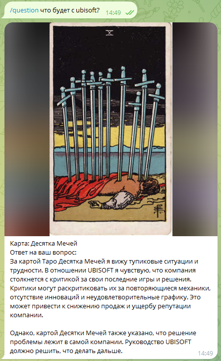

# Telegram Tarot Bot

## Install

1. pip install groq
1. pip install python-telegram-bot
1. python tarot_bot.py

## Run

1. Create access_token.txt in the root folder of the project.
1. First line should be access token for you Telegram Bot (Use @BotFather bot to create your bot.)
1. Second line should be access token to https://groq.com/ API.
1. Use run.sh to pull updates from the repo and start the service on your host (For example https://www.alwaysdata.com)

## Features

1. /card - Picks a random card from the deck with description. Repeating the command will draw the same card this day. Draws new card the next day.
1. /anycard - Picks a random card from the deck with description each time.
1. /question <question> - Picks a card and gives prediction for particular question using AI. Could be used only once a day. Question character limit is 100.

Free popular deck uploaded: Rider Waite.

# Demo

